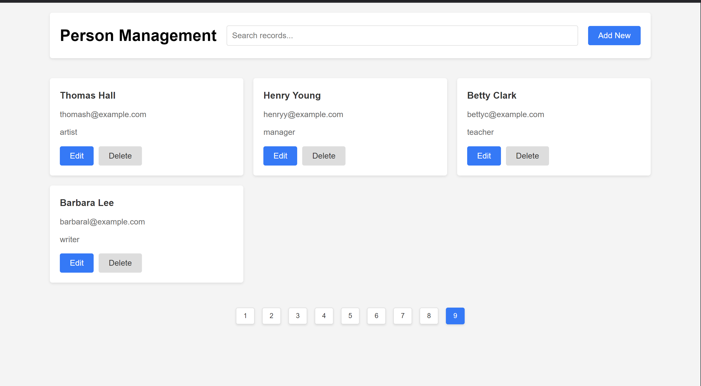
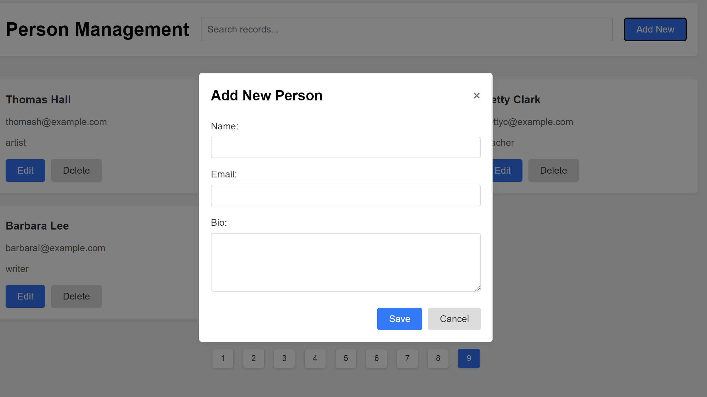
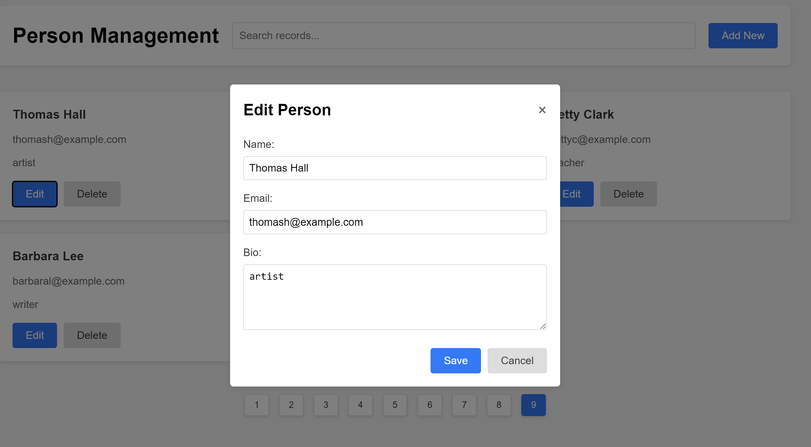

# HR People Management System: Powered by Flask & Elasticsearch

## Overview
Welcome to the **HR People Management System**! This full-stack CRUD application is designed to streamline HR workflows with **advanced employee data management**. Using **Flask** for hosting and **Elasticsearch** for fast, real-time search capabilities, this application is tailored to simplify employee management, making HR tasks efficient and hassle-free. 

## Key Features:
- **CRUD Operations**: Effortlessly create, read, update, and delete employee records.
- **Advanced Search**: Search through employee records instantly using Elasticsearch, allowing HR teams to find exactly what they need in seconds.
- **Scalable**: Built with a scalable architecture to accommodate growing teams and complex data.
- **Real-Time Updates**: Get immediate feedback when modifying employee information.
- **User-Friendly Interface**: Clean, intuitive UI designed with HTML, CSS, and JavaScript for seamless interaction.

## How It Works:
This tool empowers HR professionals by providing:
- **Employee Information Management**: Securely store and manage details such as name, role, department, and contact info.
- **Powerful Search Functionality**: Elasticsearch enables HR teams to perform high-speed searches across massive datasets, filtering through employees by name, role, or department.
- **Effortless Updates and Deletion**: Make quick updates or deletions to any employee profile directly through the UI.

### **Built With:**
- **Frontend**: HTML, CSS, JavaScript
- **Middleware**: Flask
- **Backend**: Elasticsearch

## Steps to Run the Application:
1. **Clone this repository** to your local machine:
   ```bash
   git clone https://github.com/yourusername/hr-people-management.git
   ```
2. **Run Elasticsearch** locally:
   - Follow the [ElasticSearch Setup Guide](https://www.elastic.co/guide/en/elasticsearch/reference/index.html) to install and run Elasticsearch.
     
3. **Start the Backend**: Run the Flask backend by executing the `backend.py` script:
   ```bash
   flask run
   ```
4. **Open the Application**: Follow the instructions in Python terminal to run the app.

## Screenshots:




## Future Features:
- **Employee Analytics**: Visualize employee data with real-time graphs and charts.
- **Authentication & Role-Based Access**: Secure login for HR teams with varying access levels.
- **Email Notifications**: Automated email alerts for important employee events (e.g., promotions, terminations).

---

**Feel free to contribute**, open issues, or suggest improvements!
